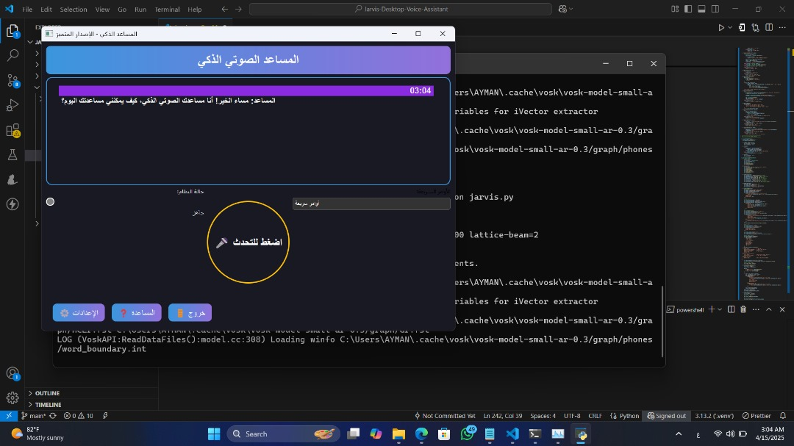

# 🧠 Ayman Voice Assistant - المساعد الصوتي العربي 🎤🇸🇦

<p align="center">
  
</p>

<p align="center">
  
  
  
  
</p>

## 📝 نظرة عامة

**المساعد الصوتي العربي** هو تطبيق ذكي بواجهة رسومية مبنية باستخدام مكتبة **PyQt5**، يتيح للمستخدم التفاعل الطبيعي عبر الصوت باللغة العربية الفصحى. يدعم تنفيذ مجموعة من الأوامر الشائعة مثل:

- 📅 عرض الوقت والتاريخ  
- 🔍 البحث في Google، YouTube، Wikipedia  
- 🎶 تشغيل الموسيقى  
- 🖼️ التقاط لقطة شاشة  
- 😂 إلقاء نكتة  
- 👨‍💻 الإجابة عن أسئلة عامة  

تم تصميمه لتعزيز تجربة التفاعل بين الإنسان والحاسوب باللغة العربية بشكل سلس وبسيط.  
يعمل بكفاءة على أنظمة Windows وLinux وmacOS.

> 🎯 هدف المشروع: توفير تجربة صوتية عربية طبيعية باستخدام تقنيات الذكاء الاصطناعي مفتوحة المصدر.

---

## 🖼️ لمحة سريعة

> *(أضف صورة GIF أو Screenshot من التطبيق هنا)*  
> 

---

## ⚙️ المزايا الرئيسية

✅ واجهة رسومية عربية أنيقة باستخدام PyQt5  
✅ دعم الأوامر الصوتية باللغة العربية  
✅ البحث في Google وYouTube وWikipedia  
✅ إظهار الوقت والتاريخ  
✅ دعم "System Tray" لتشغيل المساعد في الخلفية  
✅ مؤثرات بصرية وصوتية تفاعلية  
✅ دعم الأوامر السريعة من قائمة منسدلة

---

## 🚀 خطوات التشغيل

### 1. استنساخ المستودع
```bash
git clone https://github.com/Eng-Ayman-Twfaq/Ayman-Voice-Assistant.git
cd arabic-voice-assistant
```

### 2. إنشاء وتفعيل البيئة الافتراضية (Virtual Environment)

#### ⬢ على Windows:
```bash
python -m venv venv
venv\Scripts\activate
```

#### 🐧 على Linux / macOS:
```bash
python3 -m venv venv
source venv/bin/activate
```

### 3. تثبيت المتطلبات
```bash
pip install -r requirements.txt
```

#### 🔧 ملاحظة حول PyAudio على Windows:
```bash
pip install pipwin
pipwin install pyaudio
```

### 4. تشغيل التطبيق
```bash
python main.py
```

---

## 🎤 الأوامر الصوتية المدعومة

| الأمر                          | الوظيفة                                     |
|-------------------------------|----------------------------------------------|
| ما الوقت / كم الساعة           | عرض الوقت الحالي                             |
| ما التاريخ / ما اليوم          | عرض تاريخ اليوم                              |
| افتح جوجل                     | فتح Google والانتظار لكلمة البحث             |
| افتح يوتيوب                   | فتح YouTube والانتظار لكلمة البحث            |
| ابحث في ويكيبيديا عن [موضوع]  | جلب ملخص من ويكيبيديا                        |
| شغل موسيقى / تشغيل الموسيقى  | تشغيل مقطع موسيقي عشوائي                     |
| لقطة شاشة / سكرين شوت        | أخذ لقطة للشاشة                              |
| قل نكتة / نكتة عربية          | سماع نكتة عربية                              |
| من برمجك؟                    | عرض اسم المطور                               |
| توقف / اخرج / إيقاف          | إغلاق التطبيق                                |

---

## 📂 هيكلية الملفات

```
📦 arabic-voice-assistant
├── main.py                # ملف التشغيل الرئيسي
├── assistant.py           # منطق الذكاء الصوتي
├── assets/                # صور وأصوات إضافية
├── screenshots/           # لقطات توضيحية
├── requirements.txt       # قائمة المتطلبات
└── README.md              # هذا الملف
```

---

## 📦 المتطلبات

```bash
PyQt5
SpeechRecognition
pyttsx3
wikipedia
pyaudio
```

---

## 👨‍💻 المطور

تم تطوير هذا المشروع بواسطة:

<p align="center"> <a href="https://github.com/Eng-Ayman-Twfaq">  </a> <a href="mailto:ayman.tawfaq.developers@gmail.com">  </a> <a href="https://wa.me/967770883615">  </a> </p>
🌟 دعم المشروع
<p align="center">   </p>
إذا أعجبك المشروع:

⭐ اضغط على زر Star لدعمه

👁️ تابع المطور على GitHub

📢 شاركه مع المهتمين بالروبوتات والمشاريع التعليمية

🚀 مشاريع قادمة
تابعنا على GitHub لمشاهدة المزيد من المشاريع المستقبلية 👇

<p align="center"> <a href="https://github.com/Eng-Ayman-Twfaq">  </a> </p>